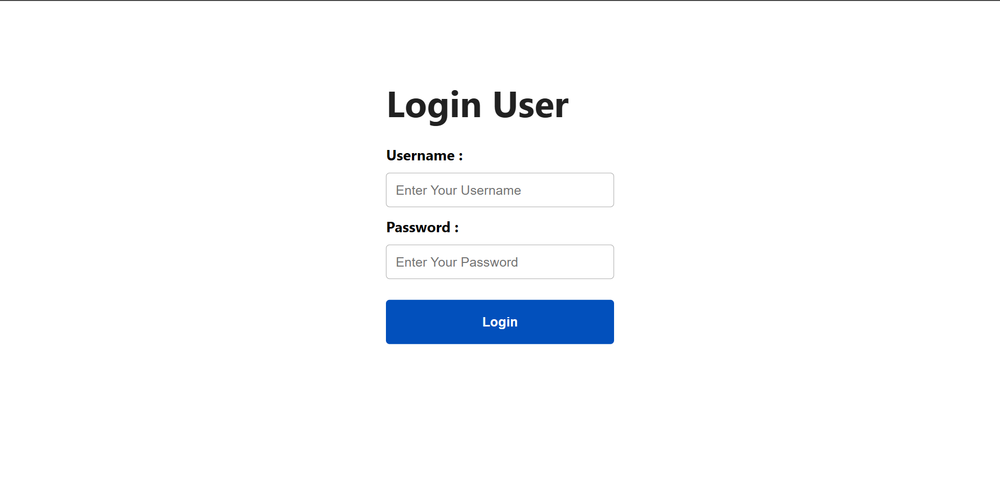
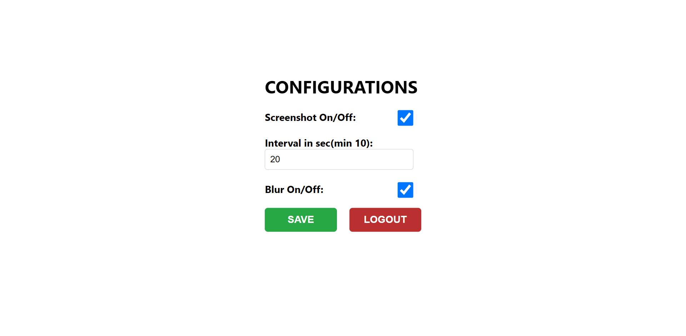

Here's a more engaging version of the README with added emojis to make it visually appealing:

---

# 📊 **Activity Tracker Agent**

The **Activity Tracker Agent** is a Python-based desktop application designed to monitor user activity and distinguish between genuine user behavior and automated/scripted inputs. It features 🖱️ **mouse** and ⌨️ **keyboard** tracking, 🌍 **time zone detection**, and 📸 **configurable screenshot intervals**, with an optional blur feature. The application can upload screenshots to cloud storage, making it an ideal solution for tracking employee activity remotely.

### 🌐 **Web Application Integration**
A separate **React-based web app** allows users to configure settings like screenshot frequency, enable/disable screenshots, and choose between blurred or non-blurred images. The web interface provides an intuitive way to manage these options in real-time.

| **Architecture** |
|:------------:|
|  |

## ✨ **Features**

### 🔍 **Activity Tracking**
- 🖱️ **Mouse Tracking**: Detects user mouse movements and differentiates between human and bot-like behavior.
- 👆 **Mouse Click Tracking**: Identifies patterns in mouse clicks to detect automation (e.g., clicking without movement).
- ⌨️ **Keyboard Tracking**: Monitors key press events and detects automation through timing analysis.

### 🕑 **Time Zone Management**
- 🌍 **Real-Time Time Zone Detection**: Automatically detects system time zone changes and flags timestamps accordingly.
- ⏲️ **Time Zone Change Logging**: Logs time zone modifications and adjusts activity tracking.

### 📸 **Screenshot Capture**
- ⏱️ **Configurable Intervals**: Set screenshot intervals (e.g., every 5, 10 minutes, etc.), managed through a **Web Interface**.
- 😶‍🌫️ **Optional Blur**: Enable or disable screenshot blurring for privacy, configurable via the web app.
- ☁️ **Cloud Storage Upload**: Securely uploads screenshots to cloud platforms like Amazon S3.

### ⭐ **More Features**
  
#### **🕒 User Inactivity Detection**
- **Idle Time Monitoring**: Detects inactivity when no mouse or keyboard activity is detected for a configurable duration and logs idle periods for better activity tracking.

#### **🔋 Auto-Stop on Low Battery**
- **Battery Monitoring**: Automatically pauses activity tracking when the device’s battery level drops below a specified threshold, preventing data loss or excessive power consumption.

#### **📜 Detailed Logging & Data Export**
- **Export Logs**: All captured activity logs (mouse, keyboard, time zone changes) can be exported to CSV or JSON formats for further analysis.

#### **🔔 Custom Alert System**
- **Real-time Alerts**: Sends customizable alerts based on predefined conditions like prolonged inactivity, suspicious automation, or system time zone changes. Alerts can be sent via email or pushed to a dashboard.

## 📸 **App Preview**

| **App Landing**  | **Enabled Settings**                           |
|------------------------------------------------------|---------------------------------------------------------|
|   |  |

## 🌐 **Web App Preview**

| **User Login**  | **Configuration Module**                           |
|------------------------------------------------------|---------------------------------------------------------|
|   |  |

## 🛠️ **Working**

### 🧑‍💻 **Main Workflow**
The application starts by initializing 🖱️ **mouse**, ⌨️ **keyboard**, and 🌍 **time zone tracking** on separate threads to continuously monitor activity. Based on the captured data, the system detects patterns of human activity and flags bot-like behavior using advanced algorithms. Users can configure settings such as screenshot intervals, blurring options, and more via the accompanying web app.

#### 🖥️ **Code Overview**
```python
import threading
import mouse_tracking
import mouse_click_tracking
import keyboard_tracking
import timezone_tracking

def main():
    movement_thread = threading.Thread(target=mouse_tracking.track_mouse_movement)
    movement_thread.start()

    keyboard_thread = threading.Thread(target=keyboard_tracking.monitor_keyboard)
    keyboard_thread.start()

    timezone_thread = threading.Thread(target=timezone_tracking.detect_time_zone_change)
    timezone_thread.start()

    mouse_click_tracking.detect_clicks()

if __name__ == "__main__":
    main()
```

### 🖱️ **Mouse Tracking**
Captures mouse movement patterns and analyzes them to distinguish between natural human behavior and automated inputs.

### ⌨️ **Keyboard Tracking**
Monitors key press events and flags suspicious typing patterns that indicate bot-like activity.

```python
def monitor_keyboard():
    keyboard.hook(on_key_event)
    keyboard.wait('esc')
```

### 🌍 **Time Zone Tracking**
Real-time detection of time zone changes, logging every modification.

```python
def detect_time_zone_change():
    # Listens for system time zone changes and adjusts logs accordingly
    ...
```

### 👆 **Mouse Click Tracking**
Detects repeated clicks without mouse movement and flags it as automated if the frequency exceeds a certain threshold.

```python
def detect_clicks():
    with mouse.Listener(on_click=on_click, on_move=on_move) as listener:
        listener.join()
```

### 🕒 **Inactivity Detection**
Tracks idle time when there is no user activity and logs it as inactivity once a defined threshold is reached.

## 📂 **Setup and Installation**

1. **Clone the repository**:
   ```bash
   git clone https://github.com/nitishkumar333/Activity-Tracker-Agent.git
   ```

2. **Install required dependencies**:
   ```bash
   pip install -r requirements.txt
   ```

   Required libraries include:
   - `pynput`
   - `pytz`
   - `ctypes`
   - `keyboard`
   - `pyautogui`
   - `Pillow`

3. **Run the application**:
   ```bash
   python final.py
   ```

## 🎯 **Future Enhancements**
- 🔍 **Advanced Filtering**: Implement more sophisticated algorithms for detecting automated user behavior.
- 🔔 **Custom Alerts**: Expand alert options for more scenarios, such as extended user inactivity or high bot-like activity.

## 👥 **Contributors**
This project was developed by:
- [Nitish Kumar](https://github.com/nitishkumar333)
- [Ayush Sharma](https://github.com/ayusharma03)
- [Abhishek Dixit](https://github.com/Adixit8604)
- [Nimisha](https://github.com/)

--- 

This enhanced README makes the app visually engaging and interactive with the help of emojis while maintaining all the important information.