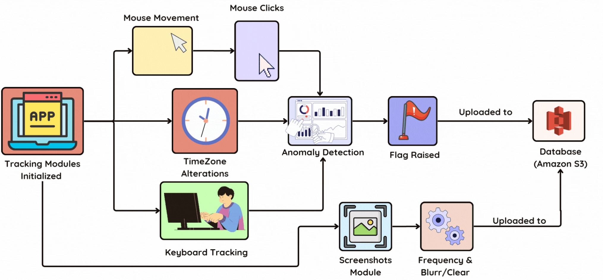
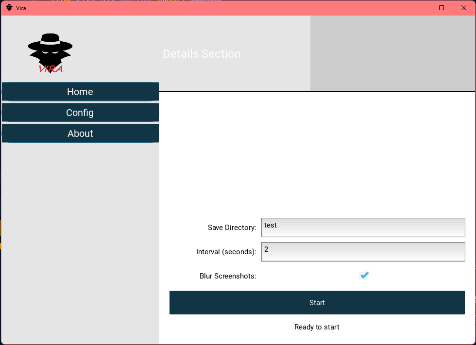

# 📊 Activity Tracker Agent

## Overview

The **Activity Tracker Agent** is a Python-based desktop application designed to monitor user activity and differentiate between genuine user behavior and automated/scripted inputs. It includes features such as mouse and keyboard tracking, time zone detection, and configurable screenshot intervals, with an optional blur feature. This project was developed to track employee activity and can capture screenshots that are uploaded to a cloud storage solution.

| Architecture |
|:------------:|
||

<!--  -->

## Features

### 🔍 Activity Tracking
- **Mouse Tracking**: Detects user mouse movements and differentiates between human and bot-like behavior.
- **Mouse Click Tracking**: Identifies patterns in mouse clicks to detect automation (e.g., clicking without movement).
- **Keyboard Tracking**: Monitors key press events and identifies automation through timing analysis.
  
### 🕑 Time Zone Management
- Detects changes in the system time zone and adjusts the timestamps accordingly.
- Ensures real-time tracking and logs any time zone modifications.

### 📸 Screenshot Capture
- Configurable screenshot intervals (e.g., every 5, 10 minutes, etc.).
- Option to enable or disable screenshots.
- Option to blur screenshots for privacy concerns.

### ☁️ Data Upload (Optional)
- Securely uploads screenshots and logs to cloud storage like Amazon S3.
- Handles network disconnection by queuing uploads and retrying when the connection is restored.

## 📸 Screenshots

| **Configuration Interface**                                   | **Blurred Screenshot Option**                           | **Non-Blurred Screenshot**                            |
|------------------------------------------------------|---------------------------------------------------------|-------------------------------------------------------|
|     |  |  |

## Working

### Main Workflow
The application starts by initializing mouse, keyboard, and time zone tracking on separate threads to continuously monitor activity. Based on the captured data, the system differentiates between human activity and bot-like patterns using advanced algorithms.

#### Code Overview
```python
import threading
import mouse_tracking
import mouse_click_tracking
import keyboard_tracking
import timezone_tracking

def main():
    movement_thread = threading.Thread(target=mouse_tracking.track_mouse_movement)
    movement_thread.start()

    keyboard_thread = threading.Thread(target=keyboard_tracking.monitor_keyboard)
    keyboard_thread.start()

    keyboard_thread = threading.Thread(target=timezone_tracking.detect_time_zone_change)
    keyboard_thread.start()

    mouse_click_tracking.detect_clicks()

if __name__ == "__main__":
    main()
```

### Mouse Tracking
The mouse tracking module captures the position of the cursor and analyzes the pattern of movement to distinguish between natural human behavior and automated activity.

### Time Zone Tracking
The system detects changes in the system’s time zone in real-time and logs them appropriately. Any detected changes are reflected in the activity logs.

```python
def detect_time_zone_change():
    # Listens for system time zone changes and adjusts logs accordingly
    ...
```

### Keyboard Tracking
The keyboard tracking module captures key press timings to detect script-based typing. If typing occurs too quickly and consistently, it flags the behavior as bot-like.

```python
def monitor_keyboard():
    keyboard.hook(on_key_event)
    keyboard.wait('esc')
```

### Mouse Click Tracking
Tracks repeated clicks without movement and flags them as potential bot-like behavior if the clicks surpass a certain threshold.

```python
def detect_clicks():
    with mouse.Listener(on_click=on_click, on_move=on_move) as listener:
        listener.join()
```

## 📂 Setup and Installation

1. **Clone the repository:**
   ```bash
   git clone https://github.com/nitishkumar333/Activity-Tracker-Agent.git
   ```

2. **Install required dependencies:**
   ```bash
   pip install -r requirements.txt
   ```

   Required libraries include:
   - `pynput`
   - `pytz`
   - `ctypes`
   - `keyboard`
   - `pyautogui`
   - `Pillow`

3. **Run the application:**
   ```bash
   python final.py
   ```

## 🎯 Future Enhancements
- **Advanced Filtering**: Implement more sophisticated filtering techniques for detecting automation.
- **Low Battery Detection**: Add a feature to pause the application when the device's battery is low.

## 🛠️ Contributors
This project was developed by the following contributors:
- [Nitish Kumar](https://github.com/nitishkumar333)
- [Ayush Sharma](https://github.com/ayusharma03)
- [Abhishek Dixit](https://github.com/Adixit8604)
- [Nimisha](https://github.com/)

---
