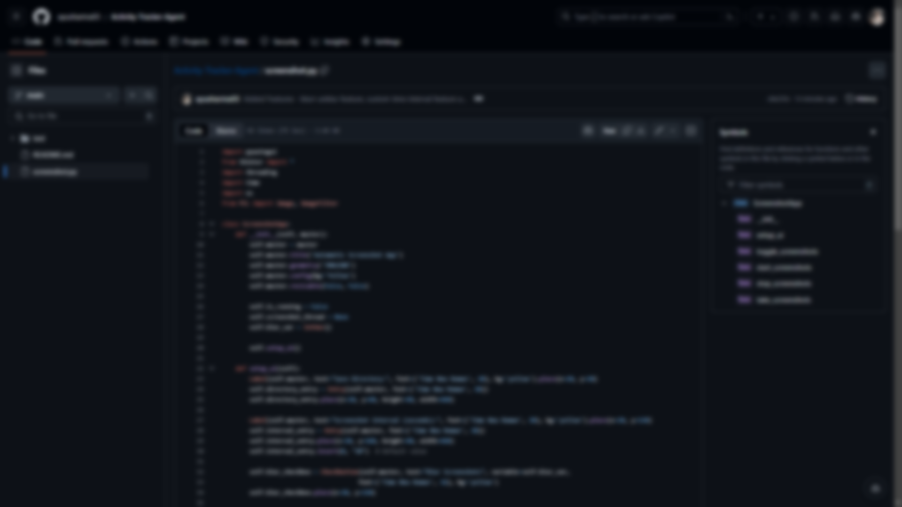

# 📸 Automatic Screenshot App

## 📝 Overview
The **Automatic Screenshot App** is a simple Python GUI application built using `Tkinter`, `PyAutoGUI`, and `PIL` (Pillow) for taking periodic screenshots of your screen. You can specify the interval between screenshots, choose a save directory, and optionally blur the screenshots.

## ✨ Features
- 🖼️ **Automatic Screenshots**: Take periodic screenshots at a specified interval.
- 📂 **Save Directory**: Choose where to save your screenshots.
- 🌀 **Optional Blur**: Apply a Gaussian blur filter to screenshots if desired.
- 🛑 **Start/Stop Functionality**: Easily start and stop the screenshot process.

## 💻 Requirements
- Python 3.x
- Required Python libraries:
  - `pyautogui`
  - `tkinter`
  - `threading`
  - `Pillow`

## ⚙️ Installation
1. **Clone the repository:**
   ```bash
   git clone https://github.com/ayusharma03/Activity-Tracker-Agent.git
   ```

2. **Install required libraries:**
   Install the required Python packages by running:
   ```bash
   pip install pyautogui Pillow
   ```

3. **Run the app:**
   Execute the script:
   ```bash
   python screenshot.py
   ```

## 🚀 Usage
1. **📂 Save Directory**: Enter the directory where screenshots will be saved. If left blank, the current directory will be used.
   
2. **⏱️ Screenshot Interval**: Specify the interval between screenshots in seconds. The default value is 30 seconds.

3. **🔍 Blur Option**: Check the box to apply a blur effect to the screenshots.

4. **🎮 Start/Stop Screenshots**: Click the "Start" button to begin capturing screenshots at the specified interval. The button will change to "Stop" to allow stopping the capture process.


## 🖼️ Screenshots

| **Main Interface**                                   | **Blurred Screenshot Option**                           | **Non-Blurred Screenshot**                            |
|------------------------------------------------------|---------------------------------------------------------|-------------------------------------------------------|
|     |  |  |

---

## 🛠️ Known Issues
- Ensure that the save directory exists or will be created if it doesn't already exist.
- The `Stop` functionality will wait for the ongoing screenshot process to complete its current cycle before stopping.

## 🔮 Future Enhancements
- 🖼️ Add options to select screenshot formats (e.g., PNG, JPG).
- 🎨 Allow advanced image filters and transformations.
- 📐 Add screenshot area selection functionality.

---