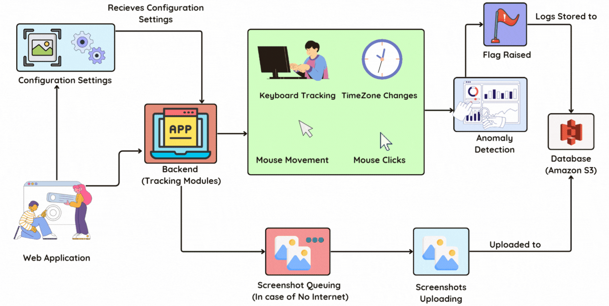
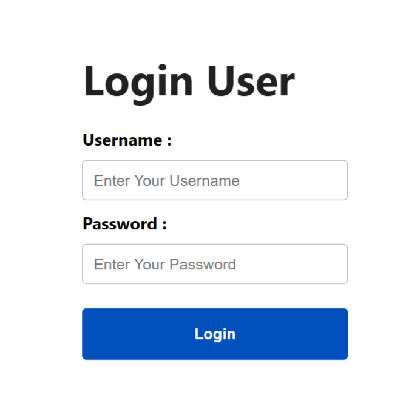
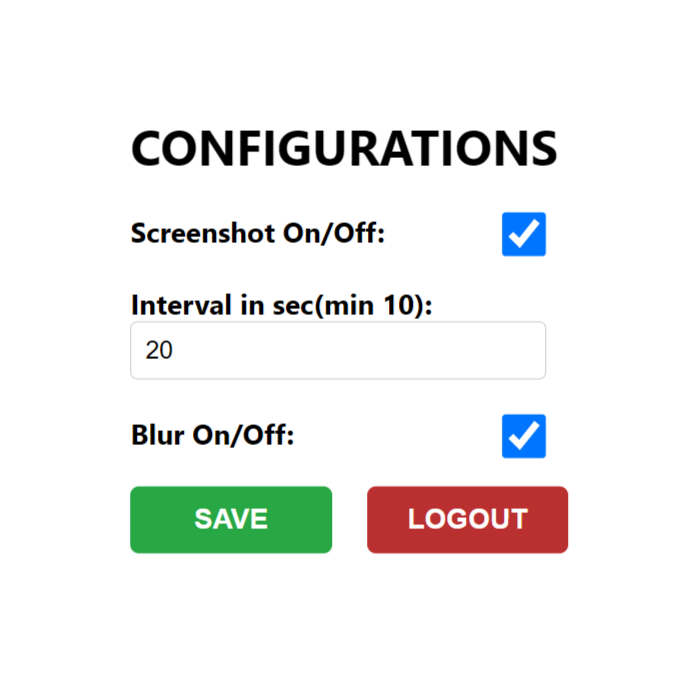
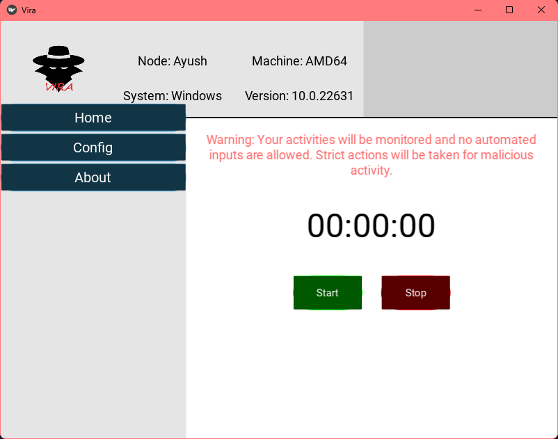
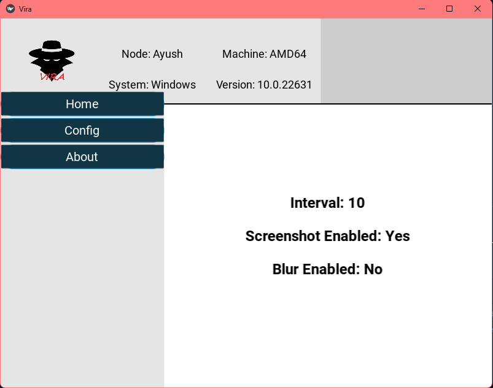

# 📊 **Activity Tracker Agent**

The **Activity Tracker Agent** is a desktop application used to track system activity and distinguish between genuine user behavior and automated/scripted inputs.

| **Architecture** |
|:------------:|
|  |

## ✨ **Features**

### 🔍 **Activity Tracking**
- 🖱️ **Mouse Tracking**: Identifies patterns in cursor moving.
- 👆 **Mouse Click Tracking**: Track if mouse is clicking without movement.
- ⌨️ **Keyboard Tracking**: Monitors key press intverals and analysis them.

### 🕑 **Time Zone Management**
- 🌍 **Time Zone Detection**: Automatically detects system time zone changes in system and report timestamps.

### 📸 **Screenshot Capture**
- ⏱️ **Configurable Intervals**: Set screenshot intervals, through the web app.
- 😶‍🌫️ **Optional Blur**: Enable/disable blurring for privacy, via the web app.
- ☁️ **Cloud Storage Upload**: Uploads screenshots to Amazon S3.
  
### 📸 **No internet connection**
- 🫸 **Queue Management**: stores the files in the queue if no internet connection, then after connectivity uploads to S3.
- ☁️ **Amazon S3 Upload**: Uploads screenshots to Amazon S3 after connection establish.

### 📸 **Encryption and Compression**
- 🫸 **Encryption**: Uses cryptography library for Encryption of screenshots
- ☁️ **Compression**: Uses gzip and zipfile library for compression of screenshots

#

### 🌐 **Web Application**
This allows users to configure settings of Python Agent like screenshot interval, enable/disable screenshots and blur.

## 🌐 **Web App Preview**

| **Authentication**  | **Configurations**                           |
|------------------------------------------------------|---------------------------------------------------------|
|   |  |

## 📸 **Python App Preview**

| **Start/Stop Script**  | **Realtime Settings**                           |
|------------------------------------------------------|---------------------------------------------------------|
|   |  |

## 🛠️ **Working**

### 🧑‍💻 **Main Workflow**
The application starts by initializing **mouse**, **keyboard**, and **time zone tracking** on separate threads to continuously monitor activity.

#### 🖥️ **Main Code Overview**
```python
import threading
import mouse_tracking
import mouse_click_tracking
import keyboard_tracking
import timezone_tracking

def main():
    movement_thread = threading.Thread(target=mouse_tracking.track_mouse_movement)
    movement_thread.start()

    keyboard_thread = threading.Thread(target=keyboard_tracking.monitor_keyboard)
    keyboard_thread.start()

    timezone_thread = threading.Thread(target=timezone_tracking.detect_time_zone_change)
    timezone_thread.start()

    mouse_click_tracking.detect_clicks()

if __name__ == "__main__":
    main()
```

## 📂 **Setting up Python Agent**

1. **Clone the repository**:
   ```bash
   git clone https://github.com/nitishkumar333/Activity-Tracker-Agent.git
   ```

2. **Install required dependencies**:
   ```bash
    pip install -r requirements.txt
   ```

3. **Add credentials in .env**:
   ```bash
    AWS_ACCESS_KEY_ID = 'your_key_id'
    AWS_SECRET_ACCESS_KEY = 'secret_key'
    REGION_NAME = 'us-east-1'
    BUCKET_NAME = 'bucket_name'
    ENCRYPTION_KEY = 'your_ency_key'
   ```

4. **Run the application**:
   ```bash
   cd activity-tracking
   python vira.py
   ```

## 📂 **Setting up Wep App**

1. **Install required dependencies**:
   ```bash
   cd web_agent
   npm install
   ```
  
2. **Add credentials in .env**:
   ```bash
    REACT_APP_AWS_ACCESS_KEY_ID = 'your_key_id'
    REACT_APP_AWS_SECRET_ACCESS_KEY = 'secret_key'
    REACT_APP_AWS_REGION_NAME = 'us-east-1'
    REACT_APP_AWS_BUCKET_NAME = 'bucket_name'
    REACT_APP_AWS_BUCKET_NAME = 'your_ency_key'

    REACT_APP_FIREBASE_API_KEY = 'your_key_id'
    REACT_APP_FIREBASE_AUTH_DOMAIN = 'your_auth_id'
    REACT_APP_FIREBASE_PROJECT_ID = 'your_project_id'
    REACT_APP_FIREBASE_STORAGE_BUCKET = 'your_storage_id'
    REACT_APP_FIREBASE_MESSAGING_ID = 'your_message_id'
    REACT_APP_FIREBASE_APP_ID = 'your_firebase_app_id'
   ```

3. **Run the application**:
   ```bash
   npm start
   ```

## 👥 **Contributors**
This project was developed by:
- [Nitish Kumar](https://github.com/nitishkumar333)
- [Ayush Sharma](https://github.com/ayusharma03)
- [Abhishek Dixit](https://github.com/Adixit8604)
- [Nimisha](https://github.com/NimishaKulshrestha)

--- 
